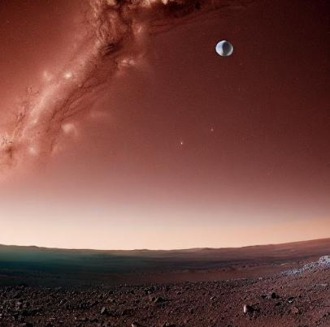
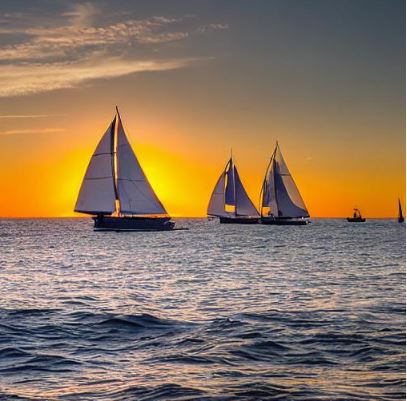
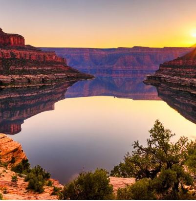

# Image Generation via Stable Diffusion v1-5 Model Card
A practice code for image generation through Stable Diffusion based on the work [here](https://huggingface.co/runwayml/stable-diffusion-v1-5).
The code produces images like the following.
## A picture for the prompt Mars, planet, beautiful.

## A picture for the prompt Ocean with yachts, happy, beautiful, sunrise.

## A picture for the prompt Water body in grand canyon, beautiful, sunset

